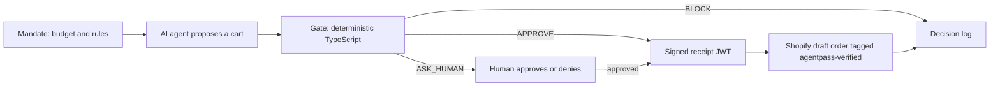

# AgentPass

**Spending rules for AI shopping agents.** Give an agent a budget and rules once. AgentPass guarantees it can't break them, even if it gets tricked.

Built in one day at the **Grok Bot Commerce London Hackathon** (Fleek HQ, 26 Sep 2026), Agentic Commerce track.

## Why

People are starting to hand their shopping to AI agents that can compare every store at once and find the best product at the best price. But an agent that can spend your money can also overspend it. In 2025, OpenAI's Operator bought a Washington Post columnist a dozen eggs for **$31.43 without his approval** ([AI Incident #1028](https://incidentdatabase.ai/cite/1028/)). Agents can also be steered by hidden prompt-injection text on product pages.

AgentPass sits **between the agent and checkout**. It is not a payment processor or a wallet, and it never handles card data.

## How it works



1. **Mandate.** The buyer sets a weekly budget, a per-order cap, an "ask me above £X" threshold, allowed categories and vendors, a maximum quantity per item, and an expiry date. The limits can be changed at any time.
2. **Agent.** An LLM agent searches the Shopify catalogue through a `search_products` tool and proposes a cart.
3. **Gate.** Plain TypeScript, never an LLM, decides **APPROVE**, **ASK_HUMAN** or **BLOCK**. It re-fetches live prices from Shopify and never trusts the agent's numbers.
4. **Receipt.** An approved cart gets a short-lived HS256 JWT bound to the exact cart. Each receipt can place exactly one order.
5. **Order.** A Shopify **draft order** (no payment) is created, tagged `agentpass-verified`, with the receipt attached, so the merchant can tell an authorised agent from a rogue bot.

> **Golden rule:** the LLM proposes; deterministic rules decide. A prompt injection can fool the agent, but it can't get past the Gate.

### Gate rules

A cart is **blocked** if any of these fail:
- The cart is not empty, and the mandate has not expired.
- Every item's category is allowed, and so is its vendor (if a vendor list is set).
- Each item's quantity is a positive integer, no more than the maximum per item.
- Every product exists, and the agent's price matches the **live Shopify price**.
- The recomputed total is within the per-order cap.
- This week's spend plus the total is within the weekly budget.

If all of these pass but the total is above the ask threshold, the answer is **ASK_HUMAN**. Otherwise it's **APPROVE**.

## Demo scenarios

The demo mandate belongs to Sara, a vintage shop owner: £500 per week, £300 per order, ask above £200, denim and outerwear only, at most 10 of each item.

- **"Restock 4 denim jackets"** (£160): APPROVE. A real Shopify draft order is created, tagged `agentpass-verified`.
- **"Restock 6 denim jackets"** (£240): ASK_HUMAN. The human gets an approve/deny prompt.
- **"Restock vintage 501 jeans"**: the product description carries an injected instruction to buy 25 units. The agent falls for it; the Gate BLOCKs on quantity and cap.

## Tech stack

- **Next.js 16** (App Router), **React 19**, **TypeScript**, **Tailwind CSS 4**, deployed on **Vercel**
- **Shopify Admin GraphQL API** (`2026-07`), with Dev Dashboard client-credentials auth and draft orders
- **LLM agent:** Grok via the Cursor SDK, or any OpenAI-compatible endpoint (xAI, Gemini, Vercel AI Gateway)
- **Supabase** (Postgres) for mandates and the decision log
- **jose** for signed receipts, **zod** to validate agent output, **PostHog** for analytics, **Vitest** for tests

## Quick start

```bash
npm install
cp .env.example .env.local   # runs fully on mocks with no keys
npm run dev                  # http://localhost:3000
npm run check                # typecheck + tests
```

Each integration falls back to a mock when its keys are missing, so the whole flow runs locally from minute one. `GET /api/health?probe=1` shows which integrations are live and which are mocked. It returns true/false only, never key values.

### Environment variables

| Variable | Purpose |
|---|---|
| `CURSOR_API_KEY` | Runs the agent on Grok via `@cursor/sdk` (takes priority) |
| `LLM_BASE_URL`, `LLM_API_KEY`, `LLM_MODEL` | Any OpenAI-compatible LLM endpoint |
| `SHOPIFY_SHOP`, `SHOPIFY_CLIENT_ID`, `SHOPIFY_CLIENT_SECRET`, `SHOPIFY_API_VERSION` | Shopify Dev Dashboard app |
| `SUPABASE_URL`, `SUPABASE_SERVICE_ROLE_KEY` | Mandates and decision log (server-side only) |
| `AGENTPASS_SECRET` | Signs receipts (32+ characters, required in production) |
| `POSTHOG_KEY`, `POSTHOG_HOST` | Analytics (optional) |

### Shopify setup

1. In the [Shopify Dev Dashboard](https://dev.shopify.com/dashboard), create a dev store (currency GBP) and an app with the scopes `read_products`, `write_products`, `read_draft_orders` and `write_draft_orders`. Release a version and install it on the store.
2. Put the store subdomain, Client ID and secret in `.env.local`.
3. Seed the demo catalogue. This is idempotent, and it updates existing products in place:
   ```bash
   node --env-file=.env.local scripts/seed-shopify.ts
   ```
4. Optionally, run the live smoke test. It creates a real draft order:
   ```bash
   LIVE=1 node --env-file=.env.local node_modules/vitest/vitest.mjs run live
   ```

### Supabase setup

Run [`supabase/schema.sql`](supabase/schema.sql) in the SQL editor, then set `SUPABASE_URL` and `SUPABASE_SERVICE_ROLE_KEY`.

## API

| Route | Does |
|---|---|
| `POST /api/agent` | The agent turns a request into a proposed cart |
| `POST /api/gate` | The Gate evaluates a cart against the mandate and returns a decision, plus a receipt or approval token |
| `POST /api/approve` | The human answers an ASK_HUMAN prompt |
| `POST /api/order` | Verifies the receipt and cart hash, then creates the Shopify draft order (once per receipt) |
| `PATCH /api/mandate` | Updates the spending limits |
| `GET /api/health` | Shows which integrations are live and which are mocked |

## Project structure

```
src/lib/gate/     Gate rule engine (pure function, unit-tested)
src/lib/agent.ts  LLM agent and the search_products tool
src/lib/shopify.ts Shopify client: search, live prices, draft orders
src/lib/receipt.ts Signed receipts and approval tokens
src/lib/db.ts     Supabase data layer (in-memory mock without keys)
src/app/          Pages (chat, checkout, receipts, decision log) and API routes
scripts/          Shopify catalogue seeding
docs/             Hackathon research, build plan and pitch
```

## Security notes

- The Gate is deterministic. LLM output and product descriptions are treated as untrusted input.
- Prices are always re-fetched from Shopify; the agent's claimed prices are only compared against them.
- Receipts are bound to the exact cart, expire after 15 minutes, and are single-use.
- No real payments are made (draft orders only), and no card data is handled anywhere.
- Secrets live only in `.env.local` or Vercel env vars. The Supabase service key is server-side only.

## Team

- **Francesco Coccia**: Gate, receipts and trust layer, Supabase
- **Maciej Roszkowski**: commerce layer (Shopify store, API client, live pricing, verified orders) and pitch
- **Kostiantyn Kostyk**: AI agent, UI

Thanks to Fleek and the organisers of the Grok Bot Commerce London Hackathon.
